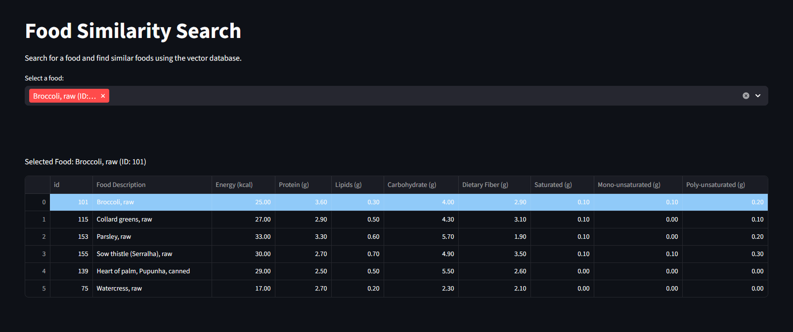

# TACO Similarity Search

This is a simple project that aims to use a vector database (ChromaDB) in order to query similar foods using vector search. The data was extracted from [TACO table](https://cfn.org.br/wp-content/uploads/2017/03/taco_4_edicao_ampliada_e_revisada.pdf) (Brazilian Table of Food Composition) using Docling at first and then manually corrected the errors found.



## How It Works

1. **Data Preparation**: Food composition data is loaded, cleaned, and normalized using pandas. 
2. **Vectorization**: Each food is stored in ChromaDB with its normalized nutritional values as embeddings.
4. **Interactive Search**: In order to let the queries more user-friendly, a streamlit server was built upon the dataframe.

## Setup & Usage

```bash
streamlit run st_interface.py
```

## 4. Data Files
- `taco_table.csv`: Original food composition table (pt-BR).
- `taco_table_en.csv`: Translated table in english.
